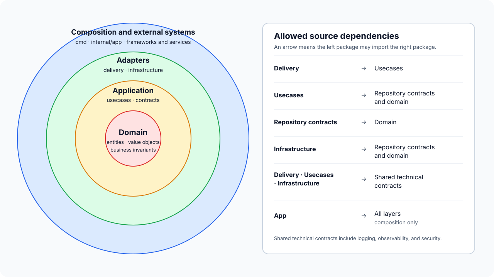
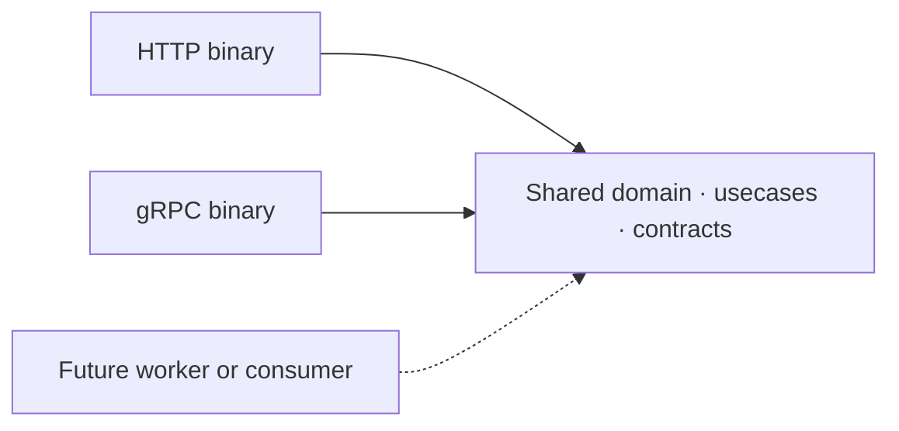
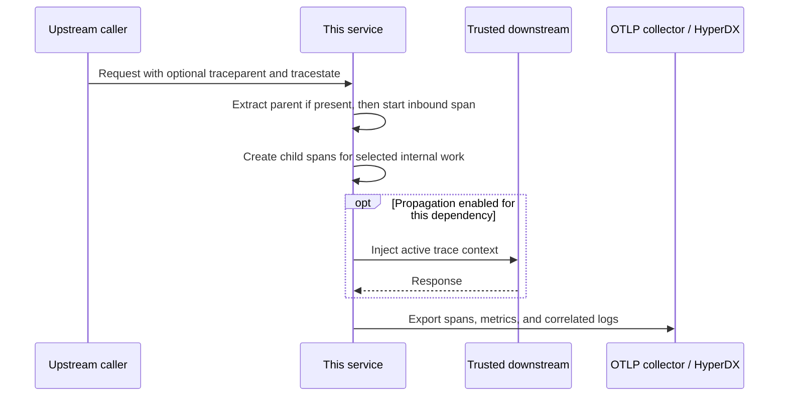

# Go Backend Architecture


[](https://github.com/eannchen/go-backend-architecture/actions/workflows/quality.yml)
[](https://github.com/eannchen/go-backend-architecture/actions/workflows/integration.yml)

A modular Go backend template built with Clean Architecture. Business workflows stay independent of delivery and infrastructure. Each runnable application wires the capabilities it needs, and new process types can reuse the same core. The template includes foundations for security, data access, observability, testing, and lifecycle management.

## Table of Contents

- [Included capabilities](#included-capabilities)
- [Architecture](#architecture)
- [Delivery adapters](#delivery-adapters)
- [Runtime reliability](#runtime-reliability)
- [Observability](#observability)
- [Data design](#data-design)
- [Testing and CI](#testing-and-ci)
- [AI agent setup](#ai-agent-setup)
- [Third-party tools](#third-party-tools)
- [Repository map](#repository-map)
- [Use as a Starter](#use-as-a-starter)

## Included capabilities

- **Architecture**
  Clean Architecture, explicit composition roots, small contracts, and independently runnable binaries
- **Public HTTP**
  OpenAPI-generated request and response models, OTP/OAuth sessions, Redis rate limiting, health endpoints, and Server-Sent Events
- **Service gRPC**
  Protobuf services, standard and detailed health APIs, interceptors, TLS/mTLS caller identity, reflection controls, and outbound client building blocks
- **Relational storage**
  SQL-first PostgreSQL with sqlc for static queries, Squirrel for dynamic queries, Goose migrations, and repository-owned transaction boundaries
- **Cache and key-value state**
  Redis adapters for caching, sessions, OTP, OAuth state, and atomic rate limiting, with explicit composition
- **Observability**
  OpenTelemetry traces, metrics, and log emission; Zap output; OTLP export; optional request-ID interoperability
- **Testing**
  Layer-owned unit tests, transport workflow tests, and container-backed PostgreSQL and Redis integration tests
- **CI**
  Static checks, race-enabled tests, integration tests, and validation of both selectable project profiles
- **AI agent setup**
  Shared engineering rules for Codex, Claude, and Cursor, plus an optional phased TDD workflow

## Architecture

Go imports follow the arrows in the diagram. Usecases do not import delivery or infrastructure, so changes to a server or storage adapter stay outside business code.



The rings group code by responsibility; the arrows specify imports. Sharing a ring does not mean two packages have identical dependencies.

| Layer | Responsibility |
| --- | --- |
| `internal/delivery` | Inbound protocol handling, transport validation, and response mapping |
| `internal/usecase` | Application workflows and business decisions |
| `internal/repository` | Outbound capability contracts required by usecases |
| `internal/domain` | Business entities, value objects, and reusable invariants |
| `internal/infra` | Adapters for persistence, caching, external services, security, logging, and telemetry |
| `internal/logger`, `internal/observability`, `internal/security` | Shared technical contracts used across layers |
| `internal/app` and `cmd` | Concrete dependency selection, process lifecycle, and startup |

### Multi-binary composition

Each binary has its own `cmd` entry point and `internal/app` composition root. Binaries can reuse domain, usecases, contracts, and infrastructure adapters without moving business code into delivery packages.



Separate binaries can be deployed and scaled independently while sharing application behavior.

### SOLID in this codebase

SOLID is applied through package boundaries and dependency direction.

- **S — Single responsibility:** delivery maps protocols, usecases coordinate workflows, repositories define outbound needs, infrastructure integrates technologies, and app packages only compose them.
- **O — Open/closed:** a new delivery adapter, provider, store, decorator, or binary is normally added behind an existing contract and selected in composition. A contract still changes when the application genuinely needs new behavior.
- **L — Liskov substitution:** implementations of a contract preserve its result, error, context, and consistency semantics, so callers do not need implementation-specific branches when an adapter or test double is substituted.
- **I — Interface segregation:** contracts expose focused behavior required by a usecase or component instead of broad CRUD or vendor-shaped APIs.
- **D — Dependency inversion:** usecases depend on repository and shared technical contracts; app packages inject infrastructure implementations. Delivery depends on usecase behavior rather than constructing stores or clients.

### Core design patterns

| Pattern | Use in this template |
| --- | --- |
| Composition root | `internal/app` selects concrete implementations and owns startup and shutdown order. |
| Adapter | Delivery adapters translate external input and application outcomes; infrastructure adapters implement application contracts with storage or external services. |
| Repository | Usecases request behavior through contracts shaped around their workflows, while infrastructure owns persistence and provider details. |
| Decorator | A composed repository or cache wrapper adds caching or coordination without changing the usecase-facing contract. |
| Strategy | Provider, security, and client policies are selected through small contracts or configuration where behavior must vary. |
| Middleware/interceptor | Cross-cutting transport behavior is applied consistently around HTTP requests and gRPC calls. |
| Null object | Optional behavior can use a safe no-op implementation instead of spreading nil checks through callers. |

The complete dependency, placement, error, performance, and testing rules are in [`AGENTS.md`](AGENTS.md).

## Delivery adapters

Out of the box, the template has a browser/public HTTP application and a service-to-service gRPC application; a selected project may retain either or both. They can share business and infrastructure capabilities while each delivery package owns its transport-specific input, output, and error handling.

### Public HTTP

The HTTP application is designed for browser and public API traffic. It owns user-facing authentication, server-side protections, JSON response semantics, and streaming behavior.

| Concern | Design |
| --- | --- |
| Contract | `contracts/http/openapi.yaml` defines endpoints and portable validation; oapi-codegen produces delivery-only models. |
| Server | Echo routes call feature handlers, which bind generated transport models and invoke usecases. |
| Request context | Preserves caller cancellation, applies a configurable deadline except for SSE, and handles optional request IDs through configurable request and response headers. |
| Responses | One responder maps application errors and context cancellation to stable HTTP status and JSON payload semantics. |
| Authentication | OTP and optional Google OAuth create Redis-backed sessions with secure cookie defaults. |
| Edge protection | Body limits, security headers, CORS allowlists, trusted-proxy client IP extraction, and Redis token-bucket rate limiting run at the origin. |
| Streaming | A bounded SSE example covers flush, disconnect, timeout, and goroutine ownership. |

The request path is ordered deliberately:

```text
body limit → observability → recovery → security/CORS → request context → rate limit → handler → usecase
```

See [`internal/delivery/http/README.md`](internal/delivery/http/README.md) for package ownership and extension guidance.

### Service-to-service gRPC

The gRPC application is designed for independently deployed backend services. A Protobuf service method is comparable to an HTTP route, a Protobuf message to a transport DTO, metadata to headers, an interceptor to middleware, and a gRPC status code to an HTTP status at the protocol boundary.

| Concern | Design |
| --- | --- |
| Contract | Versioned Protobuf under `contracts/grpc` defines services and messages; Buf lints the contract, checks breaking changes, and generates delivery-only Go types. |
| Server | grpc-go services map generated messages to usecase input. |
| Request context | Preserves caller cancellation and deadlines, adds a unary server timeout, and handles optional request IDs through configurable metadata keys. |
| Responses | One responder maps application and context errors to gRPC status codes and safe messages. |
| Caller identity | When mTLS is enabled, a verified client certificate URI can become a transport-authenticated service identity. Authorization remains a usecase decision. |
| Outbound calls | Shared connection mechanics and opt-in interceptors are available, while each remote dependency owns its methods, deadlines, retries, metadata, and telemetry policy. |

The unary and stream interceptor chain follows the same ownership model as HTTP middleware:

```text
request context → optional caller identity → observability → recovery → service → usecase
```

Both chains put recovery inside observability so recovered panics appear in telemetry. HTTP starts observability before request context because Echo lets inner middleware replace the request; outer middleware reads its updated context on return. CORS runs before the limiter so preflight requests can finish early.

gRPC interceptors cannot pass an updated context back outward. Request context and optional caller identity therefore run before observability, which needs their values. Authentication and rate limiting are not universal gRPC interceptors: deployments may enforce them at a gateway or service mesh, while standalone services can add interceptors matched to their identity and quota model.

See [`internal/delivery/grpc/README.md`](internal/delivery/grpc/README.md) and [`internal/infra/grpcclient/README.md`](internal/infra/grpcclient/README.md) for the server and outbound-client boundaries.

## Runtime reliability

The template makes request limits, background work, and shutdown explicit.

- Cancellation and deadlines reach storage and outbound calls, so work can stop when a caller disconnects or its time limit expires.
- Background tasks use an application-lifecycle context, not a request context. The component that starts a goroutine controls how it stops and waits for it to finish; concurrent work is bounded.
- Retries have bounded attempts and repeat writes only when an idempotency design makes that safe.
- Shutdown stops components in reverse dependency order and reports cleanup failures.
- Errors retain their original causes; unexpected failures are logged once where they are handled.

See [`AGENTS.md`](AGENTS.md) for the corresponding implementation rules.

## Observability

Tracing and metrics use interfaces in `internal/observability`, while structured logs use `internal/logger`. Their OpenTelemetry integration lives in infrastructure, so delivery adapters, usecases, and infrastructure operations can record telemetry without importing the SDK.

| Signal | What it records |
| --- | --- |
| Traces | Inbound boundaries and selected usecase, storage, or outbound operations, with outcome and error details |
| Metrics | Transport and application operation counts and durations, with bounded dimensions |
| Logs | Structured events from any layer, correlated with active trace/span IDs and optional request IDs |

### Trace propagation and correlation

The diagram follows one request across services; work inside a service can have its own spans and metrics.



The OpenTelemetry SDK creates trace and span IDs locally, even when the collector is unavailable. An inbound adapter extracts valid parent context when present, and spans created during internal work inherit it. For a trusted outbound dependency, optional injection lets a downstream service that extracts the context join the same trace; external providers do not automatically receive internal correlation metadata.

Zap output and OTLP logs read trace and span IDs from the active OpenTelemetry span context. HyperDX can therefore navigate between a log and its trace when both signals arrive with those native IDs. Local logs remain useful when export is unavailable, but they are a diagnostic fallback—not a replacement for the spans that were not collected.

`x-request-id` is a separate, optional convention for gateways, support workflows, or systems that do not share trace context. The current HTTP and gRPC adapters accept valid caller-provided IDs under configurable keys and may return them; they do not generate an ID when absent. Selected internal clients can propagate it explicitly.

Traces or logs can record request-specific details such as the exact path `/users/42`, an error message, or an ID when safe. Metrics instead use stable labels such as the route pattern `/users/:id` and status code; individual paths or IDs would create a separate metric series for many requests.

See [`internal/observability/README.md`](internal/observability/README.md) and the transport instrumentation guides for [HTTP](internal/delivery/http/middleware/observability/README.md) and [gRPC](internal/delivery/grpc/interceptor/observability/README.md).

## Data design

### SQL-first PostgreSQL

SQL stays behind repository contracts, keeping PostgreSQL and generated types out of business APIs. Rather than relying on an ORM to generate queries, the template writes SQL directly. This keeps joins, batching, locking, and selected columns explicit, making query behavior easier to review and important queries easier to tune with query plans. The tradeoff is more SQL and mapping code; an ORM can be reasonable for a CRUD-heavy application where convenience matters more.

| Tool | Role |
| --- | --- |
| pgx | PostgreSQL connection pool, driver behavior, and low-level database integration |
| sqlc | Go types and methods generated from static SQL |
| Squirrel | Parameterized construction for queries whose shape changes at runtime |
| Goose | Ordered database migrations for existing environments |

[`AGENTS.md`](AGENTS.md) also gives guidance for repository operations and SQL: methods should follow usecase needs rather than generic CRUD. Related reads should be shaped to avoid N+1 access; stable cacheable data may be separated from volatile data when the extra round trip has a measured consistency or reuse benefit. Multi-write workflows should expose one atomic repository operation, leaving transaction handles inside the PostgreSQL adapter. Indexes and material query changes should be evaluated against actual access patterns and query plans.

### Redis caching and state

Redis serves two roles here. Cached data can be reloaded from a primary store, while short-lived state such as sessions, OTPs, and rate-limit counters directly affects feature behavior. Separate adapters let each role define its own failure policy.

| Package role | Responsibility |
| --- | --- |
| Cache store | Stores replaceable copies of data with serialization and TTL behavior. |
| Key-value store | Owns sessions, OTPs, OAuth state, and rate-limit state whose Redis operations are part of the feature's behavior. |
| Composed adapter | Coordinates a primary repository and supporting cache behind one repository contract. |

A composed adapter can implement the cache policy a feature needs—for example, read-through, write-through, write-behind, or explicit invalidation. That policy must define acceptable staleness and how cache read, write, and invalidation failures affect the operation.

See [`internal/infra/db/postgres/store/README.md`](internal/infra/db/postgres/store/README.md) and [`internal/infra/composed/README.md`](internal/infra/composed/README.md) for adapter-specific guidance.

## Testing and CI

Unit tests check one component with its dependencies controlled. Integration tests check real boundaries, such as a storage adapter with its database or a server's request path through its delivery code.

| Scope | What is tested | Current examples |
| --- | --- | --- |
| Unit | One domain, usecase, delivery, or infrastructure component with its dependencies controlled | Business rules, response mapping, and middleware/interceptor behavior |
| Storage adapter integration | A real adapter against a disposable backend | PostgreSQL and Redis adapters tested with Testcontainers |
| Transport integration | A request through the real HTTP or gRPC server stack | HTTP authentication uses real PostgreSQL and Redis with controlled external providers; gRPC health uses in-process transport with a controlled usecase |

See [`AGENTS.md`](AGENTS.md) for test-double and concurrency-test rules.

| CI check | What it verifies |
| --- | --- |
| Build and race-enabled tests | Formatting, vet, build, and all untagged Go tests |
| Integration tests | PostgreSQL and Redis adapters, HTTP authentication workflows, and in-process gRPC server behavior |
| Template profiles | Runs the selector for HTTP-only and gRPC-only projects separately, then builds and tests each result |

## AI agent setup

The repository keeps coding guidance in one place so agents follow the same conventions.

### Rules

| File | Purpose |
| --- | --- |
| [`AGENTS.md`](AGENTS.md) | Shared implementation rules for architecture, correctness, performance, testing, and change discipline, read by Codex and Cursor. |
| [`.claude/CLAUDE.md`](.claude/CLAUDE.md) | Imports the shared rules for Claude instead of maintaining a divergent copy. |

### Skills

| File | Purpose |
| --- | --- |
| [`.agents/skills/tdd-change/SKILL.md`](.agents/skills/tdd-change/SKILL.md) | Canonical TDD workflow loaded by Codex and available to Cursor by file reference. |
| [`.claude/skills/tdd-change/SKILL.md`](.claude/skills/tdd-change/SKILL.md) | Links the canonical workflow for Claude. |

Invoke `$tdd-change` in Codex or `/tdd-change` in Claude with `Red only`, `Green only`, `Refactor only`, or `Complete cycle`. Green requires the failing tests from Red; Refactor requires passing tests. The skill follows `AGENTS.md`, including the capabilities that remain after profile selection.

## Third-party tools

| Concern | Tools |
| --- | --- |
| HTTP | [Echo v5](https://github.com/labstack/echo), [validator](https://github.com/go-playground/validator), [OpenAPI 3](https://spec.openapis.org/oas/latest.html), [oapi-codegen](https://github.com/oapi-codegen/oapi-codegen), [Vacuum](https://github.com/daveshanley/vacuum), [OASDiff](https://github.com/oasdiff/oasdiff) |
| gRPC | [grpc-go](https://github.com/grpc/grpc-go), [Protocol Buffers](https://protobuf.dev/), [Buf](https://buf.build/) |
| PostgreSQL | [pgx](https://github.com/jackc/pgx), [sqlc](https://sqlc.dev/), [Squirrel](https://github.com/Masterminds/squirrel), [Goose](https://github.com/pressly/goose) |
| Redis | [go-redis](https://github.com/redis/go-redis) |
| Object storage | [AWS SDK for Go v2](https://aws.github.io/aws-sdk-go-v2/docs/) for S3-compatible Cloudflare R2 |
| Authentication | [OAuth2 for Go](https://pkg.go.dev/golang.org/x/oauth2), [Resend](https://resend.com/) |
| Observability | [OpenTelemetry](https://opentelemetry.io/), [OTLP](https://opentelemetry.io/docs/specs/otlp/), [Zap](https://github.com/uber-go/zap), [OpenTelemetry Collector](https://opentelemetry.io/docs/collector/), [HyperDX](https://www.hyperdx.io/) |
| Testing and CI | [Testcontainers for Go](https://golang.testcontainers.org/), [GitHub Actions](https://docs.github.com/actions) |
| Local development | [Air](https://github.com/air-verse/air), [Docker Compose](https://docs.docker.com/compose/) |

## Repository map

```text
cmd/                         process entry points
contracts/                   OpenAPI and Protobuf sources
internal/
├── app/                     composition roots and shared runtime lifecycle
├── delivery/                HTTP and gRPC inbound adapters
├── domain/                  business entities and reusable invariants
├── usecase/                 application workflows
├── repository/              outbound capability contracts
├── infra/                   database, cache, provider, security, and telemetry adapters
├── logger/                  shared logging contract
├── observability/           shared telemetry contracts and context helpers
└── security/                shared security contracts
make/                        capability-owned Make targets
tools/                       one-time profile selection and project bootstrap
```

## Use as a Starter

### Requirements

- [Go 1.26+](https://go.dev/doc/install)
- [Docker](https://docs.docker.com/get-docker/) with [Docker Compose](https://docs.docker.com/compose/install/)
- [GNU Make](https://www.gnu.org/software/make/)

### 1. Choose the source shape

Keep both applications, or preview and apply one profile before bootstrapping:

```bash
# Preview first; no files are changed.
go run ./tools/profile-selector --profile public-http
go run ./tools/profile-selector --profile service-grpc

# Keep exactly one profile.
go run ./tools/profile-selector --profile public-http --apply
# or
go run ./tools/profile-selector --profile service-grpc --apply
```

The selector requires a clean checkout, removes the unused capability and itself, installs the selected `.air.toml`, `sqlc.yaml`, and `.env.example`, and writes `.template-profile`. Commit the selection before the next step.

### 2. Bootstrap project identity

```bash
./tools/bootstrap-template.sh --module github.com/your-org/your-backend
go mod tidy
```

The bootstrap updates module/import paths, service and local resource names, contract package paths, and the README title. It does not rename the checkout directory or configure the Git remote.

### 3. Start local dependencies and the application

```bash
cp .env.example .env
make install
make dev-up
make migrate-up  # when the selected source includes database migrations
```

Run the default installed application with `make run`, or choose explicitly when both are present:

```bash
make run-httpapi  # HTTP on :8080
make run-grpcapi  # gRPC on :9090
```

Verify the HTTP health endpoint:

```bash
curl 'http://localhost:8080/health?check=ready'
```

With [grpcurl](https://github.com/fullstorydev/grpcurl) installed and local reflection enabled, verify the standard gRPC health service:

```bash
grpcurl -plaintext \
  -d '{"service":"diagnostics.v1.DiagnosticsService"}' \
  localhost:9090 grpc.health.v1.Health/Check
```

The local stack exposes PostgreSQL on `5432`, Redis on `6379`, HyperDX on `8081`, and OTLP on `4317`/`4318`.

### 4. Verify the project

```bash
make check             # formatting, vet, and build
make test              # unit tests
make test-race         # unit tests with race detection
make test-integration  # HTTP, gRPC, and storage integration tests
make ci                # complete sequence once the project has a contract baseline
```

During the initial identity bootstrap, use the individual checks before comparing contracts with an earlier commit. Later, `make ci` runs contract compatibility checks against the configured Git baseline as well as the complete test sequence.

Contract-specific commands are available when their capability is installed:

```bash
make openapi-generate openapi-check
make proto-generate proto-check
```

Use `make dev-logs` to follow local infrastructure and `make dev-down` to stop it. The transport processes can be stopped separately with `make run-httpapi-stop` or `make run-grpcapi-stop`.
