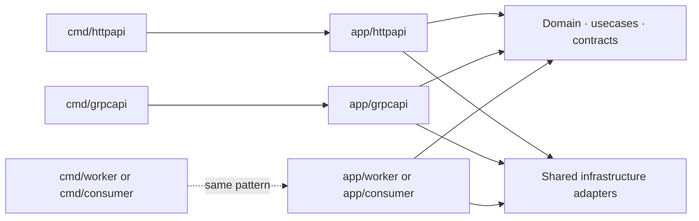
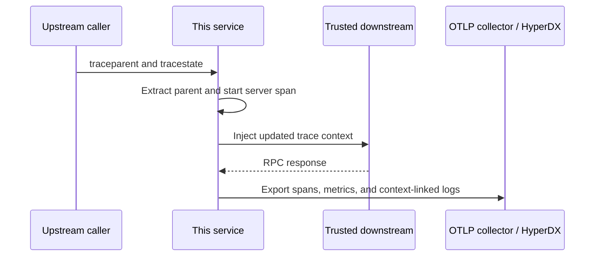

# Go Backend Architecture


[](https://github.com/eannchen/go-backend-architecture/actions/workflows/quality.yml)
[](https://github.com/eannchen/go-backend-architecture/actions/workflows/integration.yml)

A Go backend template built as a modular monolith with Clean Architecture. It keeps business behavior independent of transport and infrastructure, composes dependencies explicitly, and includes production-oriented HTTP, gRPC, data, observability, testing, and lifecycle foundations.

The repository can keep both included server applications or be reduced to one with the profile selector. Its boundaries also support adding other process types—such as message consumers and scheduled workers—without moving business logic into their delivery code.

## Included capabilities

| Capability | Included design |
| --- | --- |
| Architecture | Clean Architecture, explicit composition roots, small contracts, and independently runnable binaries |
| Public HTTP | OpenAPI-generated request and response models, OTP/OAuth sessions, Redis rate limiting, health endpoints, and Server-Sent Events |
| Service gRPC | Protobuf services, standard and detailed health APIs, interceptors, TLS/mTLS caller identity, reflection controls, and outbound client building blocks |
| PostgreSQL | SQL-first access with sqlc for static queries, Squirrel for dynamic queries, Goose migrations, and repository-owned transaction boundaries |
| Redis | Cache, key-value state, session, OTP, OAuth state, and atomic rate-limit adapters with explicit composition |
| Observability | OpenTelemetry traces, metrics, and log emission; Zap output; OTLP export; optional request-ID interoperability |
| Testing | Layer-owned unit tests, transport workflow tests, and container-backed PostgreSQL and Redis integration tests |
| CI | Race-enabled tests, contract linting and compatibility checks, generated-file checks, and validation of both selectable project profiles |
| AI-assisted engineering | Shared engineering rules for agents, Claude integration, Cursor settings, and focused subsystem documentation |

## Architecture

The dependency rule is the central design constraint: source dependencies point toward business policy. Frameworks and infrastructure can change without becoming part of the domain or usecase APIs.


| Layer | Responsibility |
| --- | --- |
| `internal/domain` | Business entities, value objects, and reusable invariants |
| `internal/usecase` | Application workflows and business decisions |
| `internal/repository`, `internal/logger`, `internal/observability`, `internal/security` | Contracts required by the application or shared across technical boundaries |
| `internal/delivery` | Inbound protocol handling, transport validation, and response mapping |
| `internal/infra` | PostgreSQL, Redis, provider, security, logging, and telemetry implementations |
| `internal/app` and `cmd` | Concrete dependency selection, process lifecycle, and startup |

Delivery converts boundary-specific input into usecase calls. Infrastructure converts application-owned operations into database, cache, network, or SDK calls. Neither adapter gives framework or vendor types to the inner layers.

### Multi-binary composition

Each executable owns one process lifecycle and one composition root while reusing the same domain, usecases, contracts, and infrastructure adapters. The existing HTTP and gRPC applications establish the pattern; another API, message consumer, or job runner can be added as a sibling rather than folded into a transport switch inside one binary.



This keeps deployment, scaling, configuration, startup, and shutdown ownership explicit for every process without duplicating business code.

### SOLID in this codebase

SOLID is applied through package boundaries and dependency direction, not by creating an interface for every struct.

- **S — Single responsibility:** delivery maps protocols, usecases coordinate workflows, repositories define outbound needs, infrastructure integrates technologies, and app packages only compose them.
- **O — Open/closed:** a new delivery adapter, provider, store, decorator, or binary is normally added behind an existing contract and selected in composition. A contract still changes when the application genuinely needs new behavior.
- **L — Liskov substitution:** implementations of a contract preserve its result, error, context, and consistency semantics, so callers do not need implementation-specific branches when an adapter or test double is substituted.
- **I — Interface segregation:** contracts expose focused behavior required by a usecase or component instead of broad CRUD or vendor-shaped APIs.
- **D — Dependency inversion:** usecases depend on repository and shared technical contracts; app packages inject infrastructure implementations. Delivery depends on usecase behavior rather than constructing stores or clients.

### Core patterns

| Pattern | Use in this template |
| --- | --- |
| Composition root | `internal/app` selects concrete implementations and owns startup and shutdown order. |
| Adapter | HTTP handlers and gRPC services map protocol input and output; stores and clients map application contracts to SQL, Redis, gRPC, or provider SDKs. |
| Repository | Usecases request behavior through contracts shaped around their workflows, while infrastructure owns persistence and provider details. |
| Decorator | A composed repository or cache wrapper adds caching or coordination without changing the usecase-facing contract. |
| Strategy | Provider, security, and client policies are selected through small contracts or configuration where behavior must vary. |
| Middleware/interceptor | Cross-cutting transport behavior is applied consistently around HTTP requests and gRPC calls. |
| Null object | Optional behavior can use a safe no-op implementation instead of spreading nil checks through callers. |

The complete dependency, placement, error, performance, and testing rules are in [`AGENTS.md`](AGENTS.md). Subsystem READMEs explain only their local ownership and extension points.

## Delivery adapters

The full template provides a browser/public HTTP application and a service-to-service gRPC application; a selected project may retain either or both. They share business and infrastructure capabilities but keep protocol models and response semantics in their own delivery packages.

### Public HTTP

The HTTP application is designed for browser and public API traffic. It owns user-facing authentication, origin-facing protection, JSON response semantics, and streaming behavior.

| Concern | Design |
| --- | --- |
| Contract | `contracts/http/openapi.yaml` defines endpoints and portable validation; oapi-codegen produces delivery-only models. |
| Server | Echo routes call feature handlers, which bind generated transport models and invoke usecases. |
| Authentication | OTP and optional Google OAuth create Redis-backed sessions with secure cookie defaults. |
| Edge protection | Body limits, security headers, CORS allowlists, trusted-proxy client IP extraction, and Redis token-bucket rate limiting run at the origin. |
| Responses | One responder maps application errors and context cancellation to stable HTTP status and JSON payload semantics. |
| Streaming | A bounded health SSE example covers flush, disconnect, timeout, and goroutine ownership. |

The request path is ordered deliberately:

```text
body limit → observability → recovery → security/CORS → request context → rate limit → handler → usecase
```

Observability surrounds recovery so a recovered panic still contributes to the request outcome. Request context runs before rate limiting and handlers so they receive the caller's context, deadline, and optional request ID.

See [`internal/delivery/http/README.md`](internal/delivery/http/README.md) for package ownership and extension guidance.

### Service-to-service gRPC

The gRPC application is designed for independently deployed backend services. A Protobuf service method is comparable to an HTTP route, a Protobuf message to a transport DTO, metadata to headers, an interceptor to middleware, and a gRPC status code to an HTTP status at the protocol boundary.

| Concern | Design |
| --- | --- |
| Contract | Versioned Protobuf under `contracts/grpc` defines services and messages; Buf lints compatibility and generates delivery-only Go types. |
| Server | grpc-go services map generated messages to usecase input and use one responder for application-to-gRPC error mapping. |
| Health | The standard gRPC health service supports infrastructure probes; the diagnostics service returns application-specific dependency details. |
| Request context | Incoming metadata and deadlines become the context passed through services, usecases, and I/O. Request-ID acceptance and response metadata are configurable. |
| Caller identity | When mTLS is enabled, a verified client certificate URI can become a transport-authenticated service identity. Authorization remains a usecase decision. |
| Outbound calls | Shared connection mechanics and opt-in interceptors are available, while each remote dependency owns its methods, deadlines, retries, metadata, and telemetry policy. |

The unary and stream interceptor chain follows the same ownership model as HTTP middleware:

```text
request context → optional caller identity → observability → recovery → service → usecase
```

The context interceptor must wrap the rest of the chain because it creates the derived context that downstream interceptors and services consume. Authentication and rate limiting are intentionally not universal: deployments may enforce them at a gateway or service mesh, while standalone services can add an interceptor matched to their identity and quota model.

See [`internal/delivery/grpc/README.md`](internal/delivery/grpc/README.md) and [`internal/infra/grpcclient/README.md`](internal/infra/grpcclient/README.md) for the server and outbound-client boundaries.

## Runtime safety

The runtime design covers failure paths that are easy to miss when code is organized only around successful requests:

- Caller cancellation and deadlines reach database, Redis, and provider calls, allowing abandoned work to stop and preserving the caller's time limit.
- Independently owned startup, reporter, and shutdown work receives its own root context and explicit cancellation instead of borrowing a request context.
- Goroutines have an owner, cancellation path, bounded input, panic policy where needed, and a completion mechanism.
- Retries are limited to documented transient failures, stop with the context, and require an idempotency decision before repeating writes.
- Shutdown proceeds in reverse dependency order and combines independent failures instead of dropping later cleanup errors.
- Each layer adds the context it owns; the layer making the handling decision logs an unexpected failure once.

These are the design highlights. [`AGENTS.md`](AGENTS.md) contains the complete implementation rules.

## Observability

OpenTelemetry is isolated behind project-owned contracts so most packages do not depend directly on its SDK. The same instrumentation vocabulary is used across inbound HTTP, inbound gRPC, and reusable outbound gRPC interceptors.

| Signal | What it records |
| --- | --- |
| Traces | Request or RPC boundaries, meaningful I/O, status, bounded semantic attributes, and error details |
| Metrics | Request/RPC counts, duration, in-flight work, and bounded outcome dimensions |
| Logs | Structured operation fields, application and transport outcomes, request IDs, and active trace/span IDs |

### Trace propagation and correlation



The OpenTelemetry SDK creates span and trace identity locally; collector availability does not determine whether IDs exist. Server instrumentation extracts a valid upstream parent, while trusted outbound instrumentation injects the active context so the downstream span joins the same trace. Propagation is opt-in for outbound dependencies because external providers should not automatically receive internal correlation metadata.

Zap output and OTLP logs read trace and span IDs from the active OpenTelemetry span context. HyperDX can therefore navigate between a log and its trace when both signals arrive with those native IDs. Local logs remain useful when export is unavailable, but they are a diagnostic fallback—not a replacement for the spans that were not collected.

`x-request-id` is a separate, optional interoperability mechanism for gateways, support workflows, or systems that do not share OpenTelemetry context. Its incoming and response names are configurable for HTTP and gRPC. Servers accept and validate it but do not generate one when absent; selected internal clients may propagate it explicitly.

Detailed errors, concrete paths, and IDs belong in traces or logs. Metric dimensions remain bounded to protect the telemetry backend from uncontrolled cardinality.

See [`internal/observability/README.md`](internal/observability/README.md) and the transport instrumentation guides for [HTTP](internal/delivery/http/middleware/observability/README.md) and [gRPC](internal/delivery/grpc/interceptor/observability/README.md).

## Data design

### SQL-first PostgreSQL

SQL is kept explicit and behind repository contracts. This preserves control over query shape and database behavior without leaking PostgreSQL or generated types into business APIs.

| Tool | Role |
| --- | --- |
| pgx | PostgreSQL connection pool, driver behavior, and low-level database integration |
| sqlc | Go types and methods generated from static SQL |
| Squirrel | Parameterized construction for queries whose shape changes at runtime |
| Goose | Ordered database migrations for existing environments |

Repository operations follow usecase needs rather than generic CRUD. Related reads are shaped to avoid N+1 access; stable cacheable data may be separated from volatile data when the extra round trip has a measured consistency or reuse benefit. Multi-write workflows expose one atomic repository operation, leaving transaction handles inside the PostgreSQL adapter. Indexes and material query changes are evaluated against actual access patterns and query plans.

The sqlc schema files describe the schema used for code generation; Goose migrations describe how an existing database reaches that schema. Both must evolve together, but they serve different purposes.

### Redis caching and state

Redis has distinct adapters because cached copies and authoritative short-lived state have different correctness rules.

| Package role | Responsibility |
| --- | --- |
| Cache store | Stores replaceable copies of data with serialization and TTL behavior. |
| Key-value store | Owns sessions, OTPs, OAuth state, and rate-limit state whose Redis operations are part of the feature's behavior. |
| Composed adapter | Coordinates a primary repository and supporting cache behind one repository contract. |

The included user composition uses cache-aside. The boundaries also support read-through, write-through, write-behind, or explicit invalidation strategies when a feature requires them; those policies are not silently assumed by the shared Redis connection. Each composed adapter defines acceptable staleness and what happens when cache reads, writes, or invalidation fail.

See [`internal/infra/db/postgres/store/README.md`](internal/infra/db/postgres/store/README.md), [`internal/infra/composed/README.md`](internal/infra/composed/README.md), and the full data-access rules in [`AGENTS.md`](AGENTS.md).

## Testing and CI

Tests protect behavior at the layer that owns it. Higher-level suites verify integration across boundaries without repeating every assertion already owned by lower layers.

| Scope | Subject kept real | Replaced or provisioned boundary |
| --- | --- | --- |
| Unit | Domain, usecase, middleware/interceptor, responder, or infrastructure component | Dependencies outside the subject use focused test doubles. |
| Adapter integration | PostgreSQL and Redis adapters | Testcontainers starts real disposable backends and each test isolates its data. |
| HTTP workflow | Routes, handlers, usecases, repositories, and infrastructure | PostgreSQL/Redis are real; external providers are controlled. |
| gRPC integration | Server, interceptors, services, usecases, and health reporting | In-process transport and controlled dependencies exercise protocol behavior. |

Contract-owner test packages provide canonical configurable doubles. Concurrency tests wait for observable state, channels, or controllable clocks rather than assuming scheduler timing.

| Workflow | Protects |
| --- | --- |
| Code quality | Formatting, vet, build, unit tests, and race detection |
| Integration tests | Container-backed PostgreSQL, Redis, and HTTP workflow behavior |
| OpenAPI contract | Lint, generated-file freshness, and backward compatibility |
| Protobuf contracts | Buf lint, generated-file freshness, and wire/generated-code compatibility |
| Template profiles | Public HTTP-only and service gRPC-only project shapes still build and test after selection |

GitHub branch protection decides which successful workflow checks are required before merge; the workflow YAML defines when and how the checks run.

## AI-assisted engineering

Agents receive the same architecture and quality constraints expected of human contributors. The setup separates project-wide engineering rules from local subsystem explanations.

| File | Purpose |
| --- | --- |
| [`AGENTS.md`](AGENTS.md) | Canonical project-wide rules for architecture, correctness, performance, testing, and change discipline. Codex reads applicable `AGENTS.md` files before working. |
| [`.claude/CLAUDE.md`](.claude/CLAUDE.md) | Imports the shared rules for Claude instead of maintaining a divergent copy. |
| [`.cursor/settings.json`](.cursor/settings.json) | Repository-local Cursor configuration for enabled tooling. |
| Subsystem `README.md` files | Human-readable ownership, boundaries, lifecycle, and extension guidance close to the relevant code. |

The rules are intentionally concrete enough to guide implementation and review, while subsystem READMEs avoid duplicating them. See the [Codex `AGENTS.md` guide](https://developers.openai.com/codex/guides/agents-md) for how Codex discovers repository instructions.

## Third-party tools

| Concern | Tools |
| --- | --- |
| HTTP | [Echo v5](https://github.com/labstack/echo), [validator](https://github.com/go-playground/validator), [OpenAPI 3](https://spec.openapis.org/oas/latest.html), [oapi-codegen](https://github.com/oapi-codegen/oapi-codegen), [Vacuum](https://github.com/daveshanley/vacuum), [OASDiff](https://github.com/oasdiff/oasdiff) |
| gRPC | [grpc-go](https://github.com/grpc/grpc-go), [Protocol Buffers](https://protobuf.dev/), [Buf](https://buf.build/) |
| PostgreSQL | [pgx](https://github.com/jackc/pgx), [sqlc](https://sqlc.dev/), [Squirrel](https://github.com/Masterminds/squirrel), [Goose](https://github.com/pressly/goose) |
| Redis | [go-redis](https://github.com/redis/go-redis) |
| Object storage | [AWS SDK for Go v2](https://aws.github.io/aws-sdk-go-v2/docs/) for S3-compatible Cloudflare R2 |
| Authentication | [OAuth2 for Go](https://pkg.go.dev/golang.org/x/oauth2), [Resend](https://resend.com/) |
| Observability | [OpenTelemetry](https://opentelemetry.io/), [OTLP](https://opentelemetry.io/docs/specs/otlp/), [Zap](https://github.com/uber-go/zap), [OpenTelemetry Collector](https://opentelemetry.io/docs/collector/), [HyperDX](https://www.hyperdx.io/) |
| Testing and CI | [Testcontainers for Go](https://golang.testcontainers.org/), [GitHub Actions](https://docs.github.com/actions) |
| Local development | [Air](https://github.com/air-verse/air), [Docker Compose](https://docs.docker.com/compose/) |

## Repository map

```text
cmd/                         process entry points
contracts/                   OpenAPI and Protobuf sources
internal/
├── app/                     composition roots and shared runtime lifecycle
├── delivery/                HTTP and gRPC inbound adapters
├── domain/                  business entities and reusable invariants
├── usecase/                 application workflows
├── repository/              outbound capability contracts
├── infra/                   database, cache, provider, security, and telemetry adapters
├── logger/                  shared logging contract
├── observability/           shared telemetry contracts and context helpers
└── security/                shared security contracts
make/                        capability-owned Make targets
tools/                       one-time profile selection and project bootstrap
```

## Quick start

### Requirements

- [Go 1.26+](https://go.dev/doc/install)
- [Docker](https://docs.docker.com/get-docker/) with [Docker Compose](https://docs.docker.com/compose/install/)
- [GNU Make](https://www.gnu.org/software/make/)

### 1. Choose the source shape

Keep both applications, or preview and apply one profile before bootstrapping:

```bash
# Preview first; no files are changed.
go run ./tools/profile-selector --profile public-http
go run ./tools/profile-selector --profile service-grpc

# Keep exactly one profile.
go run ./tools/profile-selector --profile public-http --apply
# or
go run ./tools/profile-selector --profile service-grpc --apply
```

The selector requires a clean checkout, removes the unused capability and itself, installs the selected `.air.toml`, `sqlc.yaml`, and `.env.example`, and writes `.template-profile`. Commit the selection before the next step.

### 2. Bootstrap project identity

```bash
./tools/bootstrap-template.sh --module github.com/your-org/your-backend
go mod tidy
```

The bootstrap updates module/import paths, service and local resource names, contract package paths, and the README title. It does not rename the checkout directory or configure the Git remote.

### 3. Start local dependencies and the application

```bash
cp .env.example .env
make install
make dev-up
make migrate-up  # when the selected source includes database migrations
```

Run the default installed application with `make run`, or choose explicitly when both are present:

```bash
make run-httpapi  # HTTP on :8080
make run-grpcapi  # gRPC on :9090
```

Verify the HTTP health endpoint:

```bash
curl 'http://localhost:8080/health?check=ready'
```

With [grpcurl](https://github.com/fullstorydev/grpcurl) installed and local reflection enabled, verify the standard gRPC health service:

```bash
grpcurl -plaintext \
  -d '{"service":"diagnostics.v1.DiagnosticsService"}' \
  localhost:9090 grpc.health.v1.Health/Check
```

The local stack exposes PostgreSQL on `5432`, Redis on `6379`, HyperDX on `8081`, and OTLP on `4317`/`4318`.

### 4. Verify the project

```bash
make check             # formatting, vet, and build
make test              # unit tests
make test-race         # unit tests with race detection
make test-integration  # disposable PostgreSQL and Redis integration tests
make ci                # complete sequence once the project has a contract baseline
```

During the initial identity bootstrap, use the individual checks before comparing contracts with an earlier commit. Later, `make ci` runs contract compatibility checks against the configured Git baseline as well as the complete test sequence.

Contract-specific commands are available when their capability is installed:

```bash
make openapi-generate openapi-check
make proto-generate proto-check
```

Use `make dev-logs` to follow local infrastructure and `make dev-down` to stop it. The transport processes can be stopped separately with `make run-httpapi-stop` or `make run-grpcapi-stop`.
